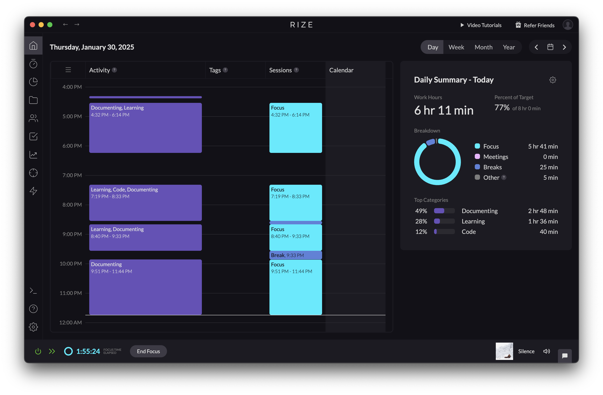

# ✏️ 웹 기초 한 줄 정리
| 단어 | 뜻  | 비고 |
| --- | --- | --- |
| 데이터베이스 | 자료의 토대   자료를 정보로 활용할 수 있도록 구조화한 데이터 집합 | - database   - 자료 > 정보 |
| 관계형 데이터베이스 | [RDB]   데이터를 테이블 형태로 관계를 나타내 구조화한 자료 집합 | - relational database   - 구성 : 행, 열 등   - sql : RDB의 다양한 수행을 위해 구조화된 언어   → 구조화된 : 정해진 문법의’ |
| 정규화 | 중복을 최소화하기 위해 구조를 재정비하는 프로세스 | 1NF : 한 행에서 각 속성의 자료는 한 개씩 있어야 함   2NF : 부분 종속 제거 (서로 다른 집합 분리)   3NF : 추이 종속 제거   → 각 속성은 기본키에만 의존하도록   - 서로 다른 집합은 아니지만 기본키가 아닌   속성으로 다른 속성을 식별하지 못하도록 함 |
| bcrypt | 인증 시 blowfish 암호화 알고리즘을 적용하여 단방향 암호화하는 해시 함수 | - blowfish + crypt   - salt : 뒤에 덧붙이는 임의의 문자열   - saltRounds : 해시 함수 실행 횟수 (2^n번)   - 설치 : `npm i bcrypt` |
| stateless | 이전 상태를 기록하지 않는 http의 특성 | - 서버의 부하 방지   - 서버 간 독립적 운영 가능   → 여러 개의 서버에 동일한 정보를 모두 기록하지 않음 |
| connectionless | http의 비연결적 특성 | - 클라이언트의 요청에 응답을 보내면 끝 |
| 인증 | 인정하기 위한 증거 | - 개인화된 정보로 서비스 제공   1. http 아이디/ 비번   2. 세션 인증 - 티켓과 유사   3. jwt(json web token) 인증 - 신분증과 유사 |
| 인가 | 권한을 부여하기 위한 허가 | - 접근 권한을 제공함으로써 정보 보호 |
| 쿠키 | 클라이언트에 저장되는 파일 | - 개인화된 서비스 제공   - 공개되어도 괜찮은 정보 |
| 세션 | 컴퓨터 간 연결을 유지할 수 있는 유효 시간/기간 | - 서버 측에 저장되는 정보   - 세션 ID → 쿠키에 저장 → 개인화된 서비스   - 공개되면 안 되는 정보   1. in-memory - CPU   2. file storage - 코드를 통해 텍스트 파일에 저장   3. database - 별도 열에 저장 |
| 프레임워크 | [일의 틀]   구현에 집중할 수 있도록 규칙/패턴을 제공하는 골조 프로그램 | - 일관성 제공 |
| 라이브러리 | sw을 개발할 때 사용하는 비휘발성 기능/자료의 집합 | - 전문성 제공   - 기능 추가에 용이 |
| API | 응용 프로그램 접점   응용 프로그램 간 소통을 위한 인터페이스 | - application programming interface   - API DOCS : 사용 설명서   - SPEC : 구성 및 구조 |
| REST API | 리소스를 이름으로 구분하여 상태 정보를 전송하는 응용 프로그램 인터페이스 | Representational state transfer   URI 규칙 → RESTful 여부 결정   - 명사 > 동사 X   - `/` : 계층 구조 → 마지막 X   - `-` > `_` X   - http request method   - 확장자 X   1. 클라이언트와 서버의 분리 → 독립적 구현   2. 데이터의 명확한 표현 → 리소스, 행위의 명확한 표현   3. 이해하기 쉬운 API → 기능의 직관성 |
| 페이징 | 다량의 데이터를 나누어 전송하는 기술 | - 데이터 병목 현상, 서버-클라이언트 부하 방지   - 사용자의 페이지 선택 ui 제공 / 무한 스크롤링 (로딩) |
| https | 전송 계층에 인증과 암호화 알고리즘을 적용하여 통신에 보안을 강화한 규약 | - s : secure   - http:// → 암호화 없이 텍스트 파일로 자료 전송 |
| 데이터 센터 | 서버 컴퓨터 및 네트워크 회선 등을 제공하는 건물/시설 | - 온프레미스 데이터 센터 : 기업/회사 전용 물리적 데이터 센터   - 클라우드 데이터 센터 : 가상 서버로 구축한 데이터 센터 |
| log | 컴퓨터 사용 및 활동의 기록 및 저장 | - log file : 기록을 저장한 파일   - 발생하는 문제의 대응 목적   - 에러 로그, SQL 로그, API 통신 로그, 이벤트 로그, 접속 로그 |

--- 

# 👀 느낀점
- 정보처리기사 공부할 때 관계형 데이터 베이스 공부하면서 정규화 부분을 이해하지 않고 넘어갔었는데 이번 강의를 들으면서 2NF, 3NF가 잘 이해가지 않아 검색을 해보았다. 부분 종속성이란 단어를 이해하지 못 했었는데 서로 다른 후보키에 대해 서로 다른 집합으로 종속적이면 이를 분리함으로써 2NF로 변경되는 것이고 3NF는 하나의 후보키로 연결되는 관계가 두 개로 나뉠 수 있는 집합인 걸 분리하는 것으로 이해했다.
- rize를 설치해서 3일째 노트북 사용 시간을 기록 중인데 한 번에 웹 기초 강의를 전부 듣는 건 좀 힘들었다. 몸 꿈틀거려서 프론트엔드, 웹 기타 내용은 내일 듣기로 했다. 

- 마지막 학기 때 데이터 베이스 다루는 거에 재미를 느꼈었는데 제대로 다뤄보고 싶다. 저번에 DB 짤 때 테이블 분리를 어떻게 해야 하는 건지 어려웠고 데이터 조회나 튜플 삽입할 때 편한 구조로 중간중간 바꿔가면서 관리했는데 재밌었다. 기본키에만 의존해야 하며 기본키로만 원소를 식별할 수 있어야 한다는 규칙을 알게된 현 시점, 정규화 과정을 제대로 지켜서 데이터베이스를 구조화해 보고 싶다.
- 그리고 클래스 다이어그램에서 클래스랑 데이터베이스에서 테이블이랑 사실 구분을 잘 못했었는데 그것도 차이를 이제 알겠다.
- 강의 한 개 듣고 바로 정리, 한 줄 정리 표로 정리, 배움일기용 말로 재정리, 이렇게 세 번을 거쳐서 정리하니까 확실히 기억이 좀 더 오래 가는 느낌이다. 근데 빨리 하루의 공부를 끝내고 싶다는 생각에 급하게 먹고 정석대로 하지 않으면 제대로 머리에 박히지 않는 기분을 그저께 느꼈다... 앞으로 화이팅..~