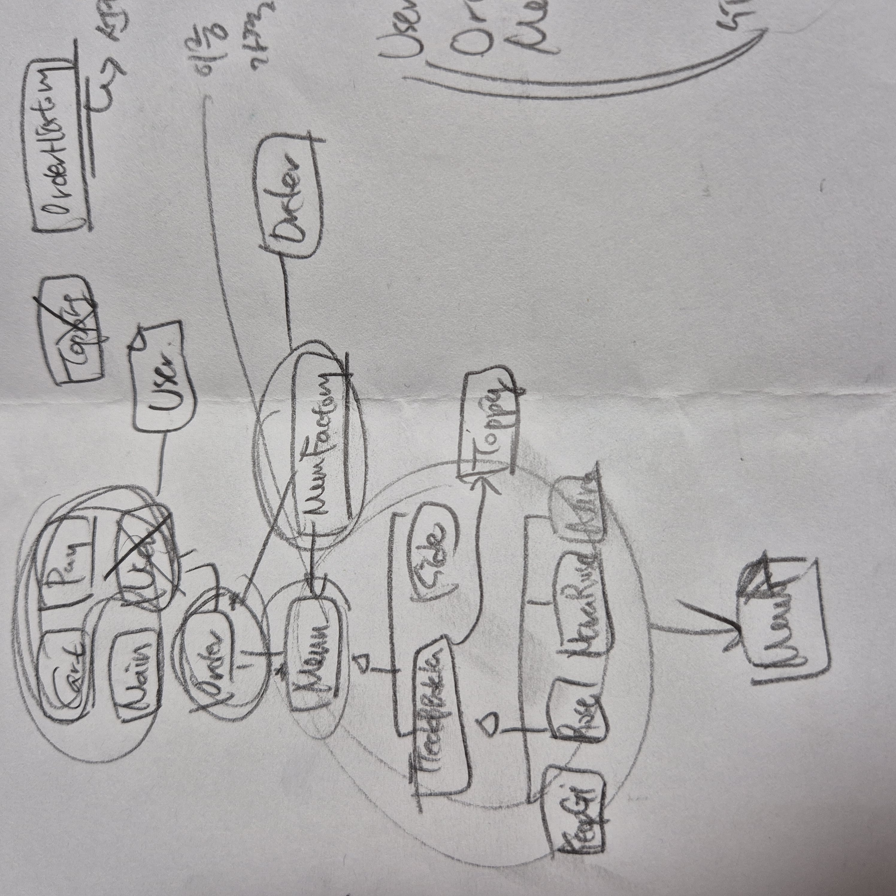
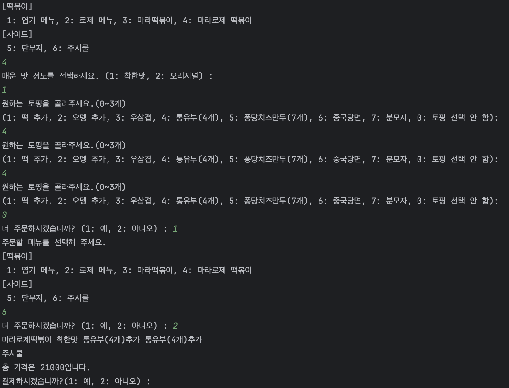
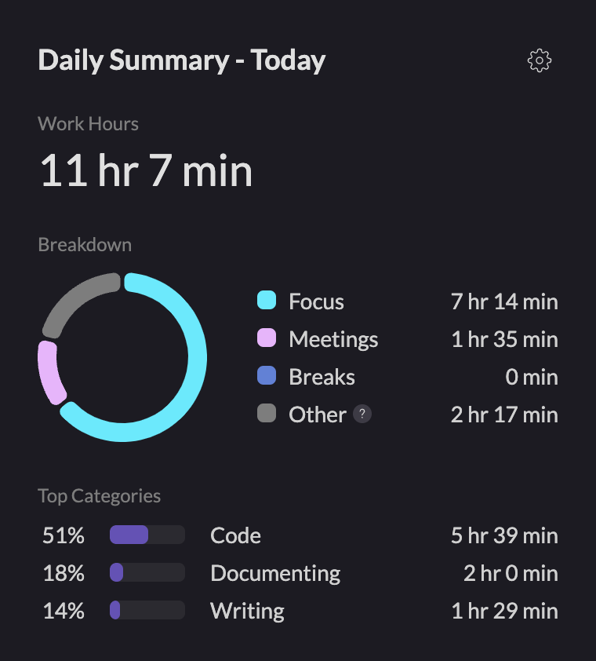

# ✏️ 설 연휴 강의 한 줄 정리 회의

다들 비슷하게 강의의 내용 대로 정리해 왔다.  
정말 자신만의 정의로 작성해 온 분도 있었는데 그 정의들도 들어보니 다 맞는 말 같았다. 
그리고 강의 그대로 정의를 정리하는 것보다 진정 자신이 해석한 정의를 쓰는 게 더 공부에 도움이 되겠다는 생각이 들었다. 
아무래도 그래야 머리에 더 잘 남겠지?  

### **1️⃣ Working Directory**

git init 하면 생성되는 **.git폴더**인가 **.git 디렉터리를 제외한 나머지 부분**인가에 대한 논의가 있었다.

- .git : 로컬 저장소에 해당
- `git init` : 로컬 저장소를 생성하는 명령어

→ 작업 폴더에서 **.git을 제외한 부분**으로 실제 파일을 생성 및 수정하는 공간  

### **2️⃣ origin이 별칭이라면 upstream도 별칭인가?**

다들 이건 고정 키워드라고 생각하였지만 검색 결과 upstream 또한 **별칭**이라고 한다.

https://wikidocs.net/66657

인터넷 찾아보니 3학년 때 교수님이 깃허브 모르겠으면 쭉 읽어보라는 글을 발견했다. 이 글에서 "upstream이라는 명칭을 주로 사용"이라는 문구가 있다. 이를 보아 원격 저장소 주소를 결국 로컬에서 관리하기 위한 키워드 설정에 불과하기 때문에 upstream이든 origin이든 abc이든 전부 별칭에 불과한 것이다. 하지만 모든 네이밍에 있어 직관성은 중요하기 때문에 "상류" 라는 뜻을 가진 upstream을 관용적으로 많이 사용하는 것이다.

생각해 보니, 어떤 레포지토리가 origin이냐에 따라 upstream 레포지토리가 달라질 수 있기 때문에 고정 키워드일 수 없다는 생각도 든다!! 
예를 들어 카테부(100_hours) 조직의 레포를 origin이라고 했다면 fork한 내 레포지토리는 downstream으로 명명할 수도 있는 것이다. (기준에 따라 키워드는 달라짐)  

### **3️⃣ pull request는 fork한 레포지토리와의 병합인가? 브랜치 간 병합인가?**

[깃허브 공식 문서] https://docs.github.com/ko/pull-requests/collaborating-with-pull-requests/proposing-changes-to-your-work-with-pull-requests/about-pull-requests

> A pull request is a proposal to merge a set of changes from one branch into another.
> 

이걸 보면 fork까지는 필요 없고 그저 한 브랜치의 변경 내용을 다른 브랜치에 병합하라는 제안에 불과하다. 다들 fork해서 프로젝트를 많이 한 것 같다. 
나는 오히려 fork해 본 적이 없고 브랜치 파서 항상 pr 올렸던 사람이라 사실 fork로만 pr 올릴 수 있지 않냐고 꽤 많은 분들이 말씀하셔서 놀랐다. '아 나도 fork 해서 플젝해야 하나?' 하는 생각을 항상 가지고 있었는데 아무래도 그렇게 프로젝트를 하는 게 맞나보다.  

### **4️⃣ API를 명세, 명세서, 규칙이라고 할 수 있는가?**

[aws 공식 문서] https://aws.amazon.com/ko/what-is/api/

나는 셋다 아니라고 생각했다. 결국 api의 목적은 기능을 가져다 쓰기 위한 연결에 있다고 생각했고 api 명세서라고 별도로 작성하기 때문에 셋다 아니라고 생각했다. 
상호작용, 인터페이스라는 단어 자체가 구현에 규칙이 당연히 존재하겠지만 "연결"이 핵심이라고 생각했다.

aws에서는 "정의 및 프로토콜 집합을 사용하여 두 소프트웨어 구성 요소가 서로 통신할 수 있게 하는 메커니즘"이라고 정의하였다. 
"인터페이스는 두 애플리케이션 간의 서비스 계약이라고 할 수 있습니다. 이 계약은 요청과 응답을 사용하여 두 애플리케이션이 서로 통신하는 방법을 정의"라고 써있는 거 보면 확실히 메커니즘, 체제에 가깝지만 어느 정도 규칙이라고 봐도 무방할 것 같다. 하지만 아직 나한테 규칙으로써의 의미는 조금 어색하다. 하지만 api 문서와는 확실히 분리하였기 때문에 api를 문서 자체로 보기는 어려울 것 같다.  

### **5️⃣ MVC 패턴은 디자인 패턴에 속하는가?**

맞다. 
처음에 내가 아니라고 했는데 GoF 디자인 패턴에는 MVC 패턴이 없어서 아니라고 했다. 근데 강의에서 router-controller 패턴을 디자인 패턴 중 하나라 소개했으면 MVC도 구현 목적을 분리함으로써 재사용성을 높이고 반복적 문제를 해결하는 디자인 패턴인 건 당연한데 왜 아니라고 생각했지? 암튼 MVC 패턴은 디자인 패턴이다. 
(저스트 멍충멍충,,~~)

### 6️⃣ 인가(authorization), 접근을 부여 vs 확인?

인증(authentication)

인가와 인증, 두 단어의 차이가 나한테는 계속 헷갈린다. 둘이 너무 비슷한 느낌인데 인증보다 인가가 좀 더 엄격한 느낌? 이 정도만 인지하고 있다. 
"부여"라는 단어에 어색해 하는 팀원이 많았다. 프론트엔드 하면서 중요하게 생각해 본 적 없는 부분이라 몰랐는데 다들 "확인"이라고 생각하였다. 
근데 나는 또 이제 인증이 확인이고 인가가 부여 아닐까요? 냅다 시전해 버림

authorization, 영어로 검색하면 우선 "권한부여(authorization)는 가고 싶은 곳으로 가도록 혹은 원하는 정보를 얻도록 허용하는 과정"이라고 검색된다. 
허용, 허가, 부여, 확인, 너무 국어로 가는 건 어렵다. 국포자에게 이런 시련을... 
그래도 차이를 좀 보자면 인증은 **누구인지** 확인하는 것이다. 접근이 불가한 원인은 **누구인지** 확인이 안 되었기 때문이다. 하지만 인가는 누구인지 확인은 되었으나 접근 권한이 없어 접근하지 못하는 것이다. "인가되었는지 확인한다"는 말과 확실한 구분이 필요해 보인다. 확인은 인가되었는지를 위한 확인이지 확인과 별개로 특정 상황이 되었을 때 권한을 부여하는 것에 가까운 듯하다.

예를 들어 카트라이더 할 때 레벨이 너무 낮으면 몇몇 맵에서 시합할 수 없다. 하지만 특정 레벨 이상이 되면 막혔던 맵에서 시합이 가능하도록 바뀌는데 이 상황이 **인가**인 것이다. 
(특정 레벨이 되었으니 높은 맵에서 시합할 수 있게 권한을 줄게.)  

### 7️⃣ 프레임워크의 목적 = 일관성?

[aws 공식 문서]https://aws.amazon.com/ko/what-is/framework/#:~:text=%ED%94%84%EB%A0%88%EC%9E%84%EC%9B%8C%ED%81%AC%EB%8A%94%20%EA%B0%9C%EB%B0%9C%EC%9E%90%EA%B0%80%20%EC%86%8C%ED%94%84%ED%8A%B8%EC%9B%A8%EC%96%B4%20%EA%B0%9C%EB%B0%9C%EC%9D%84%20%EA%B0%80%EC%86%8D%ED%95%98%EC%97%AC%20%ED%94%84%EB%A1%9C%EB%8D%95%EC%85%98%20%EB%B0%B0%ED%8F%AC%EC%97%90,%EC%BB%B4%ED%8C%8C%EC%9D%BC%EB%9F%AC%EC%99%80%20%EA%B0%99%EC%9D%80%20%ED%94%84%EB%A1%9C%EA%B7%B8%EB%9E%98%EB%B0%8D%20%EC%96%B8%EC%96%B4%EC%9A%A9%EC%9C%BC%EB%A1%9C%20%EB%B9%8C%EB%93%9C%EB%90%9C%20%EB%A6%AC%EC%86%8C%EC%8A%A4%EB%A1%9C%20%EA%B5%AC%EC%84%B1%EB%90%A9%EB%8B%88%EB%8B%A4

우선 강의에서는 프레임워크는 일관성을 제공하며, 라이브러리는 전문성을 제공한다고 해서 한 줄 정리에 그렇게 작성했던 것인데 옮겨적는 과정에서 프레임워크의 목적이 일관성은 아닌 것 같다고 대부분 말씀하셨다.  다들 생산성과 효율성에 대해 말하였다. 그리고 그 부분은 나도 공감하는 부분이다. 근데 보이드가 말한 일관성은 목적이라기보다 aws 문서에도 나와있듯이 고품질 프레임워크 자체의 특징을 말하는 것 같다. 그리고 또 드는 생각은 코딩보다 국어가 더 어려운 것 같다..

그리고 리액트가 다들 프레임워크인 줄 알았는데 갑자기 인터넷에 라이브러리라고 나와서 엥 모든 게 부정당한 느낌이었다가 여기 문서에서 또 프레임워크에 넣어버려서 급 안심.  

---

# ✏️ 1주차 과제 중간 점검

현재는 거의 구현은 다 끝난 상태이다. 
클래스 다이어그램 짜는 데만 거의 3일이 걸렸다. 어제 새벽부터 구현해서 거의 내내 하다보니 이제 끝나간다. 
확실히 설계의 중요성을 느낀다. 중간에 지금 어디 구현이 덜 됐지? 하면서 이래저래 복잡해 보이는 부분들이 있었다.

그리고 클래스 틀 짜는 것부터 시간이 좀 걸렸다. 
어떤 클래스가 필요한지부터 나열하고 연결한 다음 필요한 함수를 하나씩 썼다. (사실 함수는 거의 구현이랑 동시에 함 하하) 

[대충 결과 화면]

메뉴 고를 때 switch문을 쓰면 객체 지향성이 떨어진다고 배웠어서 이를 해결한 패턴이 팩토리 패턴인 것으로 알고 있다. 이를 최대한 적용하고 싶었고 그러다 보니 머리속에서 절차지향적으로 구상되는 것과 달리 객체지향적으로 클래스 다이어그램 그리기란 쉽지 않았다. 
우선 크게 팩토리 패턴, 싱글톤 패턴, 템플릿 메서드 패턴을 사용하였다. 이건 나중에 차차 정리할 예정..

아 근데 생각해 보니 분모자로 변경할 때 3천 원 추가되는 거 구현 안 했는데... 흠 그만 알아보자. 여기까지만 구현하는 걸로... ㅎㅎ
그래도 큰 고난 없이 구현해서 아주 맘이 편하다.  

---

# 👀 느낀점

대화를 통해 강의 자체를 서로 다르게 이해하고 중요하다 생각하는 키워드가 달라 신기했고 한 줄 정리긴 했지만 다른 사람들의 정리를 보며 내가 깊게 생각하지 않은 부분이 많구나 느꼈다.

그리고 어느 정도 직접 경험하였어도 이론이 부족한 것과는 별개라는 생각도 들었다. 다들 다양한 경험을 하였고 같은 이론 강의를 보았는데 각자의 경험에 따라 다른 답이 나오는 것이 신기했다.

1주차 과제 얘기는 다음에 하는 걸로

근데 오늘 책상에 오래 앉아있었다 후후~

