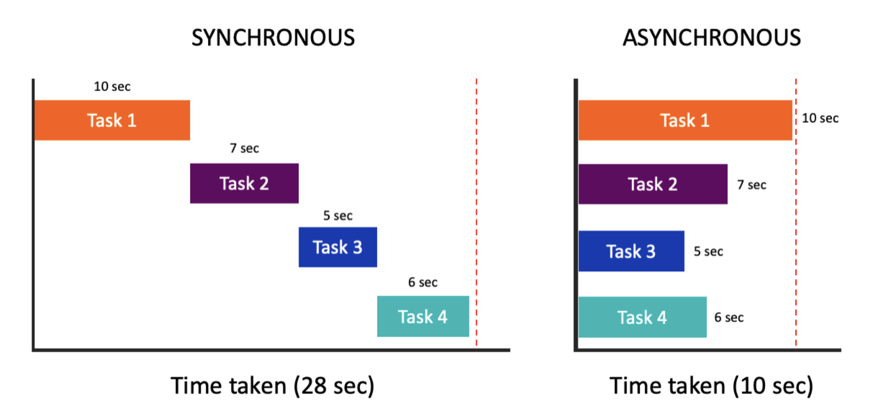

# 동기 vs 비동기

### 동기

"순차적"이라는 한 단어로 정리할 수 있을 것 같다. 하나의 함수나 작업이 수행될 때까지 다른 작업은 중단된다. 실행 흐름이 중단됨으로써 서비스의 성능 저하를 야기할 수 있다.

### 비동기

"병렬적"이라고 한 단어로 정의내릴 수 있을 듯하다. 동시에 여러 작업이 수행될 수 있다. 
입출력 작업이나 네트워크 요청 시 비동기로 많이 구현된다.



위 사진1이 동기와 비동기의 처리 시간 차이를 잘 보여준다고 생각한다.

### 사전적 의미와 다르게 사용되는 단어?

동기의 사전적 의미는 "동시에 일어나는"이다. 한 번에 하나의 작업만 수행된다는데 어떻게 일반 사전 의미가 "동시에 일어나는"일 수가 있지? 하는 생각을 했다. 하나의 요청과 이에 대한 응답의 결과가 함께 일어난다는 뜻이라는 걸 금방 알 수 있었다.

- 참고로 "syn"는 동시보다 함께에 가깝다는 뜻이다.

---

# 자바스크립트에서의 비동기

## async / await

💡 리액트로 프론트엔드 구현을 하면서 api 연동 시 두 키워드를 사용하곤 했다. 하지만 정확히 무엇인지, 왜 사용하는지 모르고 사용했던 터라 이참에 알아보자는 마인드로 한 번 가볍게 보았다.

참고로 자바스크립트는 단일 스레드 기반 언어이며 동기적으로 코드를 해석하는 언어이기 떄문에 성능 저하를 방지하기 위해 비동기 함수의 구현이 필요하다.
****1 → 2 → 3 순서로 작성된 코드에서 2가 만약 비동기 함수거나 수행까지 기다리는 시간이 정해진 함수라면 1 → 3 → 2 이런 식으로 실행될 수 있다는 것이다.

### async

asynchronous : 비동기<br>
함수 앞에 붙여 비동기임을 나타내는 키워드

### await

해당 비동기 함수에서의 작업이 완료될 때까지 실행을 중단시켜 응답을 기다리기 위한 키워드

### 예제 코드

```jsx
async function fetchData() {
	try {
    const response = await fecth('/api');
    const data = await response.json();
    return data;
  } catch (e) {
	  console.error(e);
  }
}
```

간단하게 작성된 코드이다. `function`, 함수 정의 앞에 `async` 키워드가 붙었고 비동기로 동작하는 함수에서 이외의 실행을 중단하고 api의 응답을 받기 위해 fetch 함수 앞에 `await` 키워드를 작성하였다.

어제 fetch에서 배운 비동기 과정으로 `fetch(url)`, `.then()`, `.catch()`가 있었는데 이를 async와 함수의 혼용, await, 함수 내에서의 try-catch문으로 대체할 수 있는 것이다.

---

# 느낀점

- 1주차 과제가 CLI 프로그램(동기 프로그램) 구현이라 사실 "동기 비동기"가 갑자기 궁금해서 알아본 게 오늘의 TIL까지 왔다. "동기 비동기"로 구글링 하고 처음으로 구글 첫 페이지를 전부 읽어보았다. 신기하게 첫 페이지에서 `javascript` 관련 비동기 내용이 많이 같이 정리하게 되었다. (예상치 못한 ㄴㅇㄱ)
- 아무래도 await/async 메커니즘을 데이터 요청하면서 많이 사용하기 때문에 자바스크립트에서 중요한 개념인 듯하다.
- 사실 1주차 과제 클래스 다이어그램을 그리려고 했는데 지금 3일째 갈피를 못 잡고 있다 설계 하나하나 하려다보니 클래스 다이어그램의 끝이 없어서… 조건문 없이 구현하기 위해 막 이래저래 디자인 패턴 찾아보다가 갈피 못 잡고 냅다 동기 비동기 찾아보기...
- 그리고 동기, 비동기만 찾아봐서 자바스크립트의 비동기 처리는 나중에 더 깊이 파봐야할 듯하다.
- 그래도 오늘 아마 밤새서 어떻게든 구현 시작할 듯하다. (밤낮 댕바뀜...)