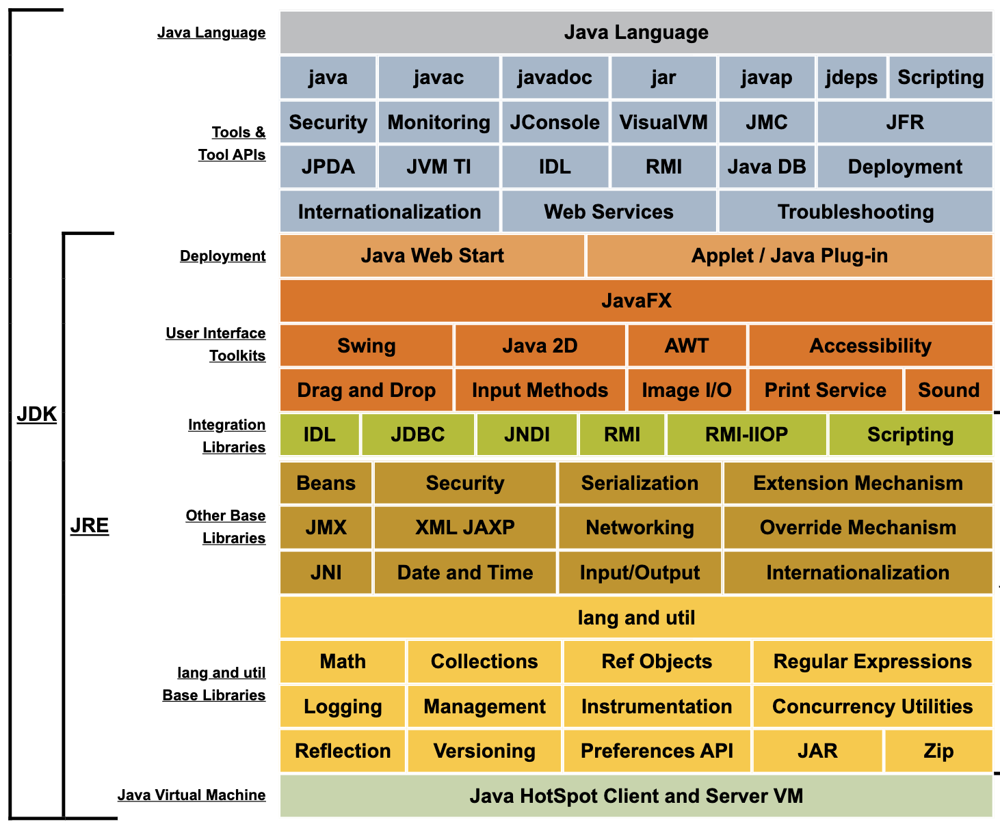

# ✏️ JDK(Java Development Kit)

[문서 링크] ****https://docs.oracle.com/javase/8/docs/

- 정의 : 애플리케이션 개발을 위한 자바 소프트웨어 환경/도구
- 특징
    - 구성 : 컴파일러, 디버거, JRE 등 (JDK는 JRE를 포함!)

# ✏️ JRE (Java Runtime Environment)

- 정의 : 자바 실행을 위한 환경
- 특징
    - 구성 : JVM, 각종 라이브러리들, 애플리케이션 실행을 위한 컴포넌트들



💡예전에는 이 그림 보고 ‘이게 뭐야 넘겨 어차피 시험에 안 나옴;;’ 하고 넘어간 표가 지금 보니 JDK 구조임을 알 수 있었다. 확실히 의미 없는 내용은 없다…하하

### 컴파일

- 정의 : JVM에서 자바 코드를 바이트 코드로 변환하는 과정
- 특징
    - 바이트 코드 파일 : `.class`
    - javac : 자바의 컴파일러
    - CLI 기반 프로그램이지만 Java Compiler API에 의해 호출되기도 함

### 런타임

- 정의 : 컴파일을 통해 바이트 코드로 바뀐 파일을 기계 코드로 변환하는 과정

# ✏️ JVM (Java Virtual Machine)

- 정의 : 자바를 실행하기 위한 가상 환경/컴퓨터
- 특징
    - 명령어를 처리하기 위한 명령어 집합을 가짐
    - 런타임동안 메모리 관리
    - 플랫폼 독립성 보장
        
        > The Java virtual machine is ported to different platforms to provide hardware- and operating system-independence.
        > 
        
        💡 공식 문서에 위와 같은 말이 있다. 1:N 멘토링 때 플랫폼에 종속적이라고 생각하는 분이 계셨는데 다른 플랫폼으로 이식(→ 자바의 이식성)된다고 써있는 걸 보면 execution engine에서의 OS에 맞는 변환이 딱 한 부분만 그런 게 아니라 여러 부분에서 맞춤형으로 동작하는 부분이 있지 않을까? 하고 우선 추측해 본다.
        
    - 구성 : Class Loader, Runtime Data Area, Execution Engine

## Class Loader

[문서] https://docs.oracle.com/en/java/javase/11/docs/api//java.base/java/lang/ClassLoader.html

- 정의 : JVM에 바이트 코드를 가져오는 역할의 객체
    
    💡 객체라고 생각하지 못했는데 객체라고 한다..!!
    
- 특징
    - class `ClassLoader` : 추상 클래스
    - 로드 → 링크 → 초기화
    
    💡 생각해 보니 이름에서 클래스 로더의 역할을 알 수 있다. .class파일을 JVM에 로드하는 거니까… 이렇게 이름이 직관적일 수가..!!
    
    ### Load
    
    - 정의 : .class 파일을 찾아 메모리에 로드하는 동작
    - 클래스 : `findClass`
    
    ### Link
    
    - 정의 : JVM에서 실행할 수 있는지 검증, 준비, 해석 과정을 통해 실행을 준비하는 동작
        - 검증 : 안전한지 검증
        - 준비 : 변수와 기본값을 위한 메모리 준비
        - 해석(분석) : 실제 메모리 주소로 변환
    - 클래스 : `resolveClass`
    
    ### 초기화
    
    - 정의 : 실행 가능한 코드를 실행하는 동작
    - 클래스 : `clearAssertionStatus`
    
    💡 초기화라는 게 잘 이해되지 않았는데 디폴트 상태가 있는 것 같다. 하나의 클래스에 대해 클래스 로더 과정을 거치면 다음 클래스를 위해 초기 로더 상태를 기존의 디폴트 상태로 초기화하는 것 같다..?!
    

## Runtime Data Area

- 정의 : JVM에서 바이트 코드가 메모리에 적재되는 영역
- 특징
    - 구성 : PC Register, JVM Stack 영역, Native Method Area, Method Area, Heap 영역
    - 직접 메모리를 지정하고 할당할 수 없음
- 스레드 : 작업 수행 단위
    - 스레드별로 PC Register, JVM Stack 영역, Native Method Area가 생성됨
    
    ### Heap 영역
    
    - 정의 : 자바에서 생성되는 객체가 저장되는 영역
    - 특징
        - 고정된 크기의 영역이 아님 (하지만 가장 큰 부분)
        - String Pool : 배열이 저장되는 영역 (힙 일부)
        - 참조 자료형과 관련(?)
        - 가비지 컬렉터의 관여를 받아 공간이 관리됨
    
    ### JVM Stack 영역
    
    - 정의 : 스레드마다 고유하게 존재하는 영역 (하나씩)
    - 특징
        - 원시 자료형과 관련(?)
        - 멤버 변수, 임시 데이터 등의 정보 저장
    
    ### Native Method Area
    
    - 정의 : 자바로 되어 있지 않은 코드를 실행하는 영역
    - 특징
        - C, C++ 등
    
    ### PC Register
    
    - 스레드가 어떤 코드를 어떤 명령으로 실행할지 관리하고 기록하는 영역
    - 특징
        - Program Counter의 약자
        - JVM 명령을 주소를 가짐
    
    ### Method
    
    - 정의 : 모든 스레드가 공유하는 영역
    - 특징
        - 클래스, 인터페이스, 바이트 코드 정보

## Execution Engine

- 정의 : JVM에서 바이트 코드를 실행하는 역할
- 특징
    - 실질적인 플랫폼 독립성을 보장하는 부분
    - OS 맞춤형 변환/실행
    
    ### 방법1. 인터프리터
    
    - 정의 : 바이트 코드를 한 줄씩 읽어 기계어로 변환/실행하는 프로그램
    - 특징
        - 미리 기계어로 변환하는 C/C++와 달리 바이트 코드로 변환된 후 한 줄씩 기계 코드로 변환되기 때문에 느림
    
    ### 방법2. JIT 컴파일러
    
    - 정의 : 반복적으로 실행되는 부분은 미리 컴파일하는 컴파일러
    - 특징
        - Just-in-Time의 약자
        - 인터프리터의 단점을 보완하고자 함 → 미리 컴파일된 부분의 실행 속도 향상
        
    
    ```java
    **⇒ 이렇게 두 가지 방법 때문에 자바는 인터프리터 언어인가 컴파일러 언어인가?** 
    나중에… 뾸뾸뾸…
    ```
    
    ### GC (Garbage Collector)
    
    - 정의 : 힙 메모리 영역에서 사용되지 않는 객체를 제거하는 과정/프로세스
    - 예시) 회원가입 기능

---

## 💡 자바코드가 JVM에서 실행되는 큰그림 순서대로 정리 해보기

[참고 자료] https://asfirstalways.tistory.com/158

1. 소스코드(.java)를 실행시킨다.
2. javac, 컴파일러에 의해 소스코드 파일은 바이트 코드 파일(.class)로 변환된다.
3. 클래스 로더는 바이트 코드 파일을 JVM의 적절한 메모리 영역에 로드한다.
4. 로드된 파일을 각 운영체제에 맞는 기계 코드로 변환한다.
5. JVM의 실질적 실행!

## 💡 클래스 파일의 상수는 JVM 메모리 안에서 어디에 저장되는가?

- 우선 어제 static 변수는 Heap 영역이 아니라 별도의 공간에 저장된다고 했으며 생존 시간이 프로그램 기간동안이기 때문에 스레드별로 있는 세 개의 영역은 아닐 것이다. (Heap, Stack, Native Method Area X)
- 세 개의 영역이 안 되는 이유를 더 생각해 보면 상수여도 java가 아닌 건 아니기 때문에 Native Method Area는 아니다.
- 멤버 변수는 생존 시간이 코드 블록 시간동안이기 때문에 (객체 생존 시간) 마찬가지로 Stack도 아니다.
- 그렇다면 PC 정보를 가졌나? 명령 정보나 그런 게 아닌 변하지 않는 단순 상수이기에 모든 스레드의 공유 영역인 Method Area라고 생각할 수 있다.

## 💡 static 변수는 GC의 대상인가?

- 우선 아니라는 결론부터 내렸다.
- 마찬가지로 static 변수는 변하지 않는 값이기도 하고 생존 시간이 프로그램 내내이기 때문에 Heap 영역에 적재돼있지 않다. 생존 기간이 런타임 내내이기 때문에 사용하지 않더라도 임의로 제거되면 안 되는 변수이기 때문에 가비지 컬렉터의 대상이 아니다.
- 생각해 보니 어제 어느 정도 결론을 내린 질문인 듯? 하하

## 💡 JVM 메모리 관점에서 `String a = ""`와 `String a = new String("")` 의 차이점

1. `String a = ""`
    - 우선 String 객체는 Heap영역 안의 String Pool에 저장된다고 하였다. 때문에 이 객체는 String Pool 에 저장될 것이다.
2. `String a = new String("")`
    - 반면  new 예약어를 사용하였기 때문에 일반 객체인 String Pool 외부의 Heap 영역에 저장될 것 같다.
    - 그럼 String Pool에는 저장되지 않는가? 사실 이건 잘 모르겠다. 그래도 예측을 해보자면 String a; 이렇게 초기화하지 않아도 우선 공간 할당은 될 것이다. 그렇다면 그 공간은 String Pool에도 저장되지 않을까? 생각해 본다. 만약 2번과 같이 선언하면 두 영역에 저장되는 것인가? 잘 모르겠다.
    
    [참고 자료] https://rlaehddnd0422.tistory.com/184
    
    - 추측 후 찾아봤는데 이미 둘을 비교한 블로그를 보았다. 후후 (Heap에만 저장되네 ㅎㅎ)

---

## 멘토링

- 코테의 비중
    - 우리가 카테부 들어올 때는 휴대폰, AI의 사용을 엄격히 관리하였기 때문에 인공지능을 사용하지 못했지만 코테의 유효성과 엄격한 관리의 필요성을 크게 느끼지 못하는 회사에서는 이를 관리하지 않고 코테를 보는 곳이 많기 때문에 코테의 비중이 줄어들고 있는 건 맞다.
    - 코테에 많이 나오는 유형이 있다. → 나중에 한 번에 알려줄 것이다. (케빈 👍👍👍)
- 데브옵스 하는 사람이 되기 위해
    - 신입 데브옵스는 뽑지 않는다.
    - 백엔드 개발자로 취업 후 데브 옵스 공부를 하거나 데브 옵스를 병행하는 회사를 가라.
        - 요즘은 백엔드와 데브 옵스의 경계가 희미해지는 경향
- 회사의 분위기는 어떻게 알 수 있을까?
    - 면접 때 질문하기.
- 시장이 좋지 않은 원인
    - 경기가 안좋아서 투자자가 없다.
- 해외 취업
    - 카카오는 해외에서 인정되는 기업은 아니다.
    - 하지만 국내 취업과 크게 다를 건 없음

---

## 느낀점

공식문서를 통해 개발자의 역량을 기르는 게 좋다는 케빈의 말을 듣고 jdk공식 문서를 찾아보았다. 어디서부터 어떻게 이 많은 정보를 읽고 정리할 수 있을까 막막했지만 우선 제공된 키워드를 기반으로 하나씩 읽어보자는 마음으로 읽었다. 사실 신뢰성 높은 정보를 위해서는 그래왔어야 하지만 블로그가 읽기 편한 건 어쩔 수 없으니 하하 근데 왜 나는 공식문서 사이트 찾는 거부터 오래 걸리는 겨..;

자바 버전에 따라 바뀌는 부분도 있어서 한 번 제대로 파보고 싶은데 우선은 위 문서로 봤다. 공식 문서를 보니 케빈이 말한 컴파일러를 구현할 수 있다는 말이 진짜임을 알 수 있었다. 문서에 각 클래스/기능 구현을 위해 어떤 함수, 어떤 클래스를 구현했는지 전부 나와있다. 하이엔드 이상의 개발자겠지? ㄷㄷ

어제까지는 그래도 어느 정도 들어본 개념들이어서 정리하기 편했는데 오늘 배운 건 jdk, jre 단어만 들어봤지 아예 모른다고 봐도 되는 개념들이었어서 찾아보고 싶은 것도 많고 이래저래 양은 가장 적지만 이걸 쓰는 데 가장 오래 걸린 날이었다.

근데 개인적으로 추론 능력이 아주 약하다고 생각하는데 계속 이렇게 질답식으로 공부해 나가면 추론 능력과 자료 조사 능력이 향상될 것 같다. 질답 과정 좀 재밌기도?
